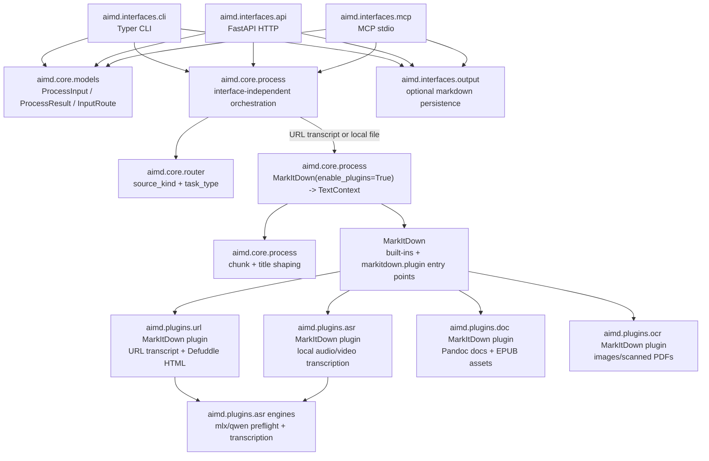

# PROJECT KNOWLEDGE BASE

**Generated:** 2026-06-22
**Version:** 0.10.0
**Branch:** main

## OVERVIEW

`aimd` is a Python context-preparation toolkit for LLM workflows. It turns URLs, audio/video, and documents into Markdown-like text context.

Interfaces:

- **CLI**: `aimd`
- **HTTP API**: `aimd-api` / FastAPI
- **MCP server**: `aimd-mcp` / stdio

Published distribution:

- **PyPI package**: `aimd-tool`
- **Import package**: `aimd`
- **Layout**: single root project using `src/aimd/`

## CURRENT STRUCTURE

```text
src/aimd/
├── interfaces/     # Typer CLI, FastAPI HTTP API, MCP stdio server, output.py persistence
│   ├── cli/        # aimd.interfaces.cli:main
│   ├── api/        # aimd.interfaces.api:main
│   ├── mcp/        # aimd.interfaces.mcp.app:main
│   └── output.py   # Shared interface-owned markdown persistence
├── core/           # Interface-independent routing, models, MarkItDown wrapping
└── plugins/        # Bundled MarkItDown plugins and implementations
    ├── url/        # URL transcript/readable HTML extraction
    ├── asr/        # Local audio/video transcription
    ├── doc/        # Pandoc-backed document conversion
    └── ocr/        # OCR for scanned PDFs/images
```

Tests live under `tests/`; architecture notes live in `docs/architecture.md`.

## ARCHITECTURE DIAGRAM



## WHERE TO LOOK

| Task | Location | Notes |
|------|----------|-------|
| Input routing | `src/aimd/core/router.py` | Maps source_kind + task_type into an `InputRoute`. |
| Core processing | `src/aimd/core/process.py` | Sends URL and local-file work through MarkItDown and wraps Markdown into `TextContext`. |
| Local file conversion | `src/aimd/core/process.py` | Calls `MarkItDown(enable_plugins=True)` and wraps Markdown into `TextContext`. |
| URL conversion | `src/aimd/plugins/url/` | MarkItDown plugin for yt-dlp transcript URLs and opt-in Defuddle readable HTML extraction. |
| Request/result models | `src/aimd/core/models.py` | `ProcessInput`, `ProcessResult`, `TaskType`; output files are interface-owned. |
| Output persistence | `src/aimd/interfaces/output.py` | Shared CLI/API/MCP markdown persistence helpers. |
| CLI | `src/aimd/interfaces/cli/app.py` | Typer command, user output, local file persistence. |
| HTTP API | `src/aimd/interfaces/api/app.py` | `/healthz`, `/v1/engines`, `/v1/process`. |
| MCP server | `src/aimd/interfaces/mcp/app.py` | `healthz`, `list_engines`, `process_input`. |
| Engine preflight | `src/aimd/plugins/asr/capabilities.py` | Audio engine availability and auto-resolution. |
| ASR processing | `src/aimd/plugins/asr/` | MarkItDown plugin for local audio/video transcription, model validation, ffmpeg transcoding. |
| Markdown shaping | `src/aimd/core/process.py` | Chunking and title extraction for MarkItDown/URL output. |
| Document conversion | `src/aimd/plugins/doc/` | MarkItDown plugin, Pandoc-supported formats, EPUB cleanup/image extraction. |
| OCR conversion | `src/aimd/plugins/ocr/` | MarkItDown plugin, OCR engines, image/scanned PDF processing. |

## CONVENTIONS

- **Async-first**: processing paths are async through core and feature modules.
- **Core is interface-independent**: CLI/API/MCP live in `aimd.interfaces.cli`, `aimd.interfaces.api`, and `aimd.interfaces.mcp`; `aimd.core` must not import them.
- **Route model**: classify inputs with `InputRoute(source_kind, task_type)`; `source_kind` is the supplied input kind, `task_type` selects processing logic.
- **MarkItDown contract**: URL and local-file conversion go through `MarkItDown(enable_plugins=True)`; bundled feature modules register MarkItDown plugins.
- **Output ownership**: `output_file` belongs to CLI/API/MCP interfaces, not `ProcessInput` or `ProcessResult`; use `aimd.interfaces.output` for shared persistence.
- **Fail-fast preflight**: validate selected engines before expensive work.
- **Typed errors**: raise `AimdError` subclasses where possible for predictable CLI/API/MCP mapping.
- **Stable output contract**: processing returns `TextContext(title, chunk_list, split_header_level)`.
- **URL cookie behavior**: keep automatic browser-cookie probing when no explicit cookie option is supplied; it is intentional user convenience for restricted media. Explicit cookie arguments should fail fast when invalid, and URL transcript/audio fallback failures should not be hidden behind metadata-only success results.
- **uv only**: use `uv run`, `uv sync`; avoid poetry/pip for local development workflows.
- **Platform-conditional audio deps**: `mlx-audio` on Darwin; Qwen3-ASR runs through the Transformers backend on Linux/CUDA.
- **Module boundaries**: `aimd.core` owns interface-independent routing and `TextContext` wrapping; `aimd.plugins.url` owns URL extraction/readable HTML and its MarkItDown plugin; `aimd.plugins.asr` owns ASR engines and the local audio/video MarkItDown plugin; `aimd.plugins.doc` and `aimd.plugins.ocr` own their MarkItDown plugins.

## ANTI-PATTERNS

- Embedding core routing/orchestration directly in interfaces.
- Importing interface modules from `aimd.core` or feature packages.
- Raising generic exceptions where a domain error exists.
- Changing URL subtitle/cookie/audio fallback ordering without explicit tests.
- Removing automatic URL browser-cookie probing without an explicit product decision; simplify surrounding error handling instead.
- Returning metadata-only URL output as a successful transcript when subtitle extraction and audio transcription both failed.
- Hard-coding stale audio model allow-lists or help text that blocks newer `mlx-audio` STT models.
- Adding broad abstractions before OCR requirements prove they are needed.

## COMMANDS

```bash
# Setup / dependency refresh
uv sync --dev --upgrade

# Code quality
uv run ruff check --fix
uv run ruff format
uv run prek --all-files
uv run prek autoupdate

# Tests
uv run pytest -q

# Build package
uv build

# CLI examples
aimd audio.mp3
aimd "https://youtube.com/..."
aimd document.epub
aimd audio.mp3 --engine mlx --model mlx-community/parakeet-tdt-0.6b-v3
aimd "https://youtube.com/..." --cookies-from-browser chrome --raw-transcript
aimd audio.mp3 --temp-dir ./tmp --log-level DEBUG

# API
aimd-api
curl http://127.0.0.1:8000/healthz
curl http://127.0.0.1:8000/v1/engines

# MCP
aimd-mcp
```

## DAILY MAINTENANCE / RELEASE CHECKLIST

```bash
# 1) Refresh environment and lockfile
uv sync --dev --upgrade

# 2) Refresh pre-commit hooks when doing maintenance
uv run prek autoupdate

# 3) Run hooks
uv run prek --all-files

# 4) If hooks changed files, stage/re-run once
git add -A
uv run prek --all-files

# 5) Run tests
uv run pytest -q
```

For version bumps:

```bash
uv version --bump patch  # or minor/major
```

## PACKAGE / DEPENDENCY NOTES

- Single PyPI distribution: `aimd-tool`.
- Import namespace: `aimd`.
- Console scripts: `aimd`, `aimd-api`, `aimd-mcp`.
- Console entry points: `aimd.interfaces.cli:main`, `aimd.interfaces.api:main`, `aimd.interfaces.mcp.app:main`.
- MarkItDown plugin entry points: `aimd.plugins.asr`, `aimd.plugins.url`, `aimd.plugins.doc`, `aimd.plugins.ocr`.
- `aimd-tool[all]` installs API/MCP runtime dependencies.
- Dev group includes API/MCP dependencies so tests run with `uv sync --dev`.
- `torch`/`torchaudio` resolve from the PyTorch CPU wheel index on Darwin.
- `defuddle` is a Node/TypeScript package; `aimd.plugins.url` registers the opt-in readable HTML converter and wraps `npx defuddle parse` rather than vendoring Node code.
- URL extraction supports Netscape cookie files, explicit browser cookie sources, and automatic browser-cookie probing when no cookie option is supplied. Invalid explicit cookie options should be reported directly.
- URL transcript extraction should prefer subtitles, then audio transcription fallback; if both paths produce no text, treat it as a processing failure rather than a metadata-only success.
- `--raw-transcript` preserves original SRT/VTT subtitle formatting; default strips subtitles to plain text.
- `--temp-dir` and `AIMD_TEMP_DIR` redirect temporary downloads, transcoding, and document extraction.
- URL and local file conversion use MarkItDown and installed `markitdown.plugin` entry points.
- Document conversion lives in the `aimd.plugins.doc` MarkItDown plugin. EPUB uses spine ordering, Pandoc CLI (`-f html -t markdown_mmd-raw_html --wrap=none`), post-processing cleanup, and flat image extraction; other Pandoc-supported formats use direct Pandoc conversion.
- Pandoc does not support MOBI/AZW3 as input formats, so AIMD does not route them as document inputs.
