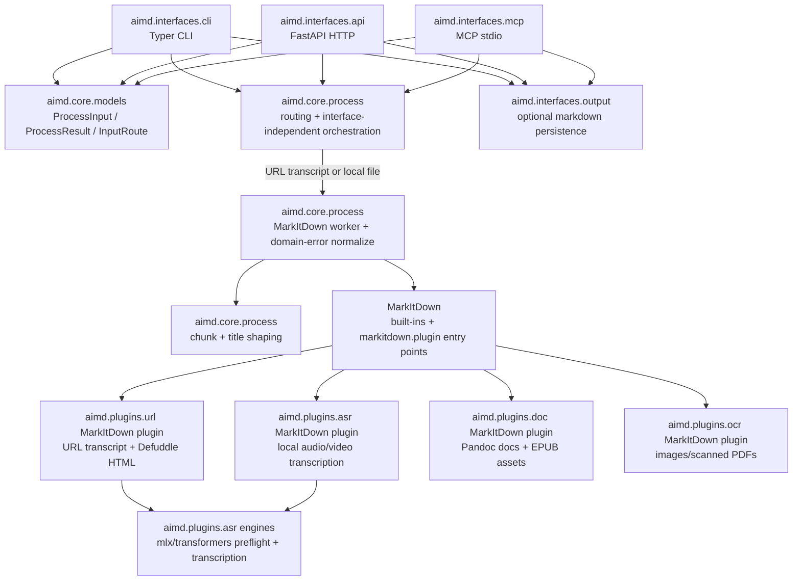

# PROJECT KNOWLEDGE BASE

**Generated:** 2026-08-01
**Version:** 0.16.0
**Branch:** main

## OVERVIEW

`aimd` is a Python context-preparation toolkit for LLM workflows. It turns URLs, audio/video, and documents into Markdown-like text context.

Interfaces:

- **CLI**: `aimd`
- **HTTP API**: `aimd-api` / FastAPI
- **MCP server**: `aimd-mcp` / stdio

Published distribution:

- **PyPI package**: `aimd-tool`
- **Import package**: `aimd`
- **Layout**: single root project using `src/aimd/`

## CURRENT STRUCTURE

```text
src/aimd/
├── interfaces/     # Typer CLI, FastAPI HTTP API, MCP stdio server, output.py persistence
│   ├── cli/        # aimd.interfaces.cli:main
│   ├── api/        # aimd.interfaces.api:main
│   ├── mcp/        # aimd.interfaces.mcp.app:main
│   └── output.py   # Shared interface-owned markdown persistence
├── core/           # Interface-independent routing, models, MarkItDown wrapping
└── plugins/        # Bundled MarkItDown plugins and implementations
    ├── url/        # URL transcript/readable HTML extraction
    ├── asr/        # Local audio/video transcription (+ models/ mlx|transformers)
    ├── doc/        # Pandoc-backed document conversion
    └── ocr/        # OCR for scanned PDFs/images (+ models/ mlx|got|unlimited|generic)
```

Tests live under `tests/`; architecture notes live in `docs/architecture.md`.

## ARCHITECTURE DIAGRAM



## WHERE TO LOOK

| Task | Location | Notes |
|------|----------|-------|
| Input routing | `src/aimd/core/process.py` | Maps source_kind + task_type into an `InputRoute`. |
| Model precision | `src/aimd/core/precision.py` | Normalizes `4bit`, `6bit`, `8bit`, and `bf16`; rejects unsupported Transformers quantization. |
| Core processing | `src/aimd/core/process.py` | Sends URL and local-file work through MarkItDown and wraps Markdown into `TextContext`. |
| Local file conversion | `src/aimd/core/process.py` | Runs MarkItDown off-loop via `_run_markitdown`, normalizes aggregate failures, wraps Markdown into `TextContext`. |
| URL conversion | `src/aimd/plugins/url/` | MarkItDown plugin for yt-dlp transcript URLs and opt-in readable HTML extraction. Logic lives directly under `src/aimd/plugins/url/` (flattened, no transcript/ subpackage). |
| Request/result models | `src/aimd/core/models.py` | `ProcessInput`, `ProcessResult`, `TaskType`; output files are interface-owned. |
| Output persistence | `src/aimd/interfaces/output.py` | Shared CLI/API/MCP markdown persistence helpers. |
| CLI | `src/aimd/interfaces/cli/app.py` | Typer command (`--task` parity with API/MCP), user output, local file persistence. |
| HTTP API | `src/aimd/interfaces/api/app.py` | `/healthz`, `/readyz`, `/v1/process`, and `/v1/jobs` lifecycle/SSE. |
| MCP server | `src/aimd/interfaces/mcp/app.py` | `healthz`, `process_input` (validates `task_type`). |
| Engine preflight | `src/aimd/plugins/asr/capabilities.py` | Audio engine availability and auto-resolution. |
| ASR processing | `src/aimd/plugins/asr/` | MarkItDown plugin for local audio/video transcription; backends in `asr/models/`. |
| Markdown shaping | `src/aimd/core/process.py` | Chunking and title extraction for MarkItDown/URL output. |
| Document conversion | `src/aimd/plugins/doc/` | MarkItDown plugin, Pandoc-supported formats, EPUB cleanup/image extraction. |
| OCR conversion | `src/aimd/plugins/ocr/` | MarkItDown plugin; engines in `ocr/models/`, image/scanned PDF processing. |

## CONVENTIONS

- **Async-first**: processing paths are async through core and feature modules.
- **Core is interface-independent**: CLI/API/MCP live in `aimd.interfaces.cli`, `aimd.interfaces.api`, and `aimd.interfaces.mcp`; `aimd.core` must not import them.
- **Route model**: classify inputs with `InputRoute(source_kind, task_type)`; `source_kind` is the supplied input kind, `task_type` selects processing logic.
- **MarkItDown contract**: URL and local-file conversion go through `MarkItDown(enable_plugins=True)` on a worker thread; core restores nested domain errors from MarkItDown aggregates before wrapping unknowns as `ProcessingFailedError`.
- **Feature error boundaries**: missing backends (`pandoc`/`npx`/ASR) -> `BackendUnavailableError`; missing inputs -> `InputNotFoundError`; conversion failures -> `ProcessingFailedError`.
- **Output ownership**: `output_file` belongs to CLI/API/MCP interfaces, not `ProcessInput` or `ProcessResult`; use `aimd.interfaces.output` for shared persistence.
- **Desktop sidecar boundary**: desktop launches are authenticated, loopback-only, and
  constrained by canonical `AIMD_ALLOWED_ROOTS`; see `docs/sidecar.md`.
- **Cooperative job cancellation**: pass optional cancellation/progress callbacks through
  core and plugin kwargs. Check cancellation only at safe processor boundaries; retain
  completed artifacts from uninterruptible work as `completed_after_request`.
- **Fail-fast preflight**: validate platform-selected backends and requested models before expensive work.
- **Typed errors**: raise `AimdError` subclasses where possible for predictable CLI/API/MCP mapping.
- **Stable output contract**: `ProcessResult` preserves lossless `markdown` and an optional
  `asset_base_uri` alongside `TextContext(title, chunk_list, split_header_level)`.
  Viewers consume `markdown`; context-window consumers continue to use `chunk_list`.
- **URL cookie behavior**: keep automatic browser-cookie probing when no explicit cookie option is supplied; it is intentional user convenience for restricted media. Explicit cookie arguments should fail fast when invalid, and URL transcript/audio fallback failures should not be hidden behind metadata-only success results.
- **Model naming**: use kebab-case user-facing aliases, including `qwen3-asr-1.7b`, `qwen3-asr-0.6b`, `unlimited-ocr`, and `glm-ocr`. Legacy underscore aliases remain compatibility inputs but must not be the canonical names in new docs or help text.
- **Precision separation**: expose model family/size through `model` and quantization/dtype through the separate `precision` option. Supported values are `4bit`, `6bit`, `8bit`, and `bf16`; dash/space/case variants may be normalized at the shared precision boundary.
- **Precision propagation**: `ProcessInput.precision` must be forwarded by CLI, HTTP API, MCP, core MarkItDown kwargs, URL audio fallback, local ASR, and OCR. Keep the new field optional and append it to public function signatures for compatibility.
- **ASR context biasing**: `ProcessInput.context` (explicit biasing text) and `ProcessInput.metadata_context` (default `True`) are forwarded by CLI (`--context`/`--no-context`), HTTP API, MCP, and core MarkItDown kwargs. The URL plugin builds context from page metadata (title/author/description/tags/chapters, capped at 2000 chars) via `build_metadata_context` in `aimd.plugins.url.metadata` and injects it into the audio fallback. Qwen3-ASR consumes it as a system prompt (`system_prompt` in mlx-audio, a system chat message in Transformers); unsupported models skip it with a warning.
- **uv only**: use `uv run`, `uv sync`; avoid poetry/pip for local development workflows.
- **Platform-conditional audio deps**: `mlx-audio` on Darwin; Qwen3-ASR runs through the Transformers backend on CUDA-capable non-Darwin platforms.
- **Module boundaries**: `aimd.core` owns interface-independent routing and `TextContext` wrapping; `aimd.plugins.url` owns URL extraction/readable HTML and its MarkItDown plugin; `aimd.plugins.asr` owns ASR engines and the local audio/video MarkItDown plugin; `aimd.plugins.doc` and `aimd.plugins.ocr` own their MarkItDown plugins.

## MODEL AND PRECISION DESIGN

The user-facing model selection contract separates model family/size from
precision:

```bash
aimd audio.wav --model qwen3-asr-1.7b --precision 4bit
aimd scan.pdf --model unlimited-ocr --precision 8bit
aimd scan.pdf --model glm-ocr --precision bf16
```

Supported model families are intentionally narrow:

- **MLX ASR**: `qwen3-asr-1.7b` and `qwen3-asr-0.6b`, each with
  `4bit`, `6bit`, `8bit`, and `bf16`. Omitted precision defaults to `4bit`
  and resolves to the matching `mlx-community/Qwen3-ASR-*` checkpoint.
- **MLX OCR**: `unlimited-ocr` and `glm-ocr`, each with the same four
  precisions. Omitted precision defaults to the 4-bit
  `mlx-community/Unlimited-OCR-4bit` or `mlx-community/GLM-OCR-4bit`
  checkpoint. Unlimited-OCR keeps its dedicated gundam-mode and repetition
  guard; GLM-OCR uses the standard VLM generation path.
- **Transformers ASR**: the two Qwen3-ASR `-hf` checkpoints. Omitted
  precision keeps automatic dtype selection. Explicit `bf16` is allowed only
  when CUDA is available and reports bf16 support; `4bit`, `6bit`, and `8bit`
  are rejected because these model adapters do not implement quantized loading.
- **Transformers OCR**: `baidu/Unlimited-OCR` and `zai-org/GLM-OCR`. The
  same automatic dtype behavior applies when precision is omitted, and only
  supported CUDA `bf16` is accepted explicitly.

Full Hugging Face IDs and legacy aliases remain compatibility inputs, but new
CLI/API/MCP documentation must use the kebab-case aliases and the separate
`precision` field. A 4-bit Qwen3-ASR transcription that triggers the existing
repetition-loop detector may retry the same segment with its corresponding
8-bit MLX checkpoint; other precisions do not auto-switch.

## ANTI-PATTERNS

- Embedding core routing/orchestration directly in interfaces.
- Importing interface modules from `aimd.core` or feature packages.
- Raising generic exceptions where a domain error exists.
- Changing URL subtitle/cookie/audio fallback ordering without explicit tests.
- Removing automatic URL browser-cookie probing without an explicit product decision; simplify surrounding error handling instead.
- Returning metadata-only URL output as a successful transcript when subtitle extraction and audio transcription both failed.
- Hard-coding stale audio model allow-lists or help text that blocks newer `mlx-audio` STT models.
- Adding broad abstractions before OCR requirements prove they are needed.

## COMMANDS

```bash
# Setup / dependency refresh
uv sync --dev --upgrade

# Code quality
uv run ruff check --fix
uv run ruff format
uv run prek --all-files
uv run prek autoupdate

# Tests
uv run pytest -q

# Build package
uv build

# CLI examples
aimd audio.mp3
aimd "https://youtube.com/..."
aimd document.epub
aimd audio.mp3 --model qwen3-asr-1.7b --precision 4bit
aimd "https://youtube.com/..." --cookies-from-browser chrome --raw-transcript
aimd audio.mp3 --temp-dir ./tmp --log-level DEBUG

# API
aimd-api
curl http://127.0.0.1:8000/healthz
curl -X POST http://127.0.0.1:8000/v1/process \
  -H 'content-type: application/json' \
  -d '{"input_source":"audio.mp3","model":"qwen3-asr-1.7b","precision":"4bit"}'

# MCP
aimd-mcp
```

## BEFORE EVERY COMMIT

Run lint/format hooks before committing, and include any hook-generated fixes in the commit:

```bash
uv run prek --all-files
```

If `prek` modifies files, review the diff, stage the updates, and run `uv run prek --all-files` again before committing.

Use Conventional Commits so release-please can generate changelog entries and select the next version automatically:

```text
feat(asr): add local Qwen3-ASR Transformers backend
fix(url): preserve subtitle fallback errors
perf(asr): enable KV cache for MPS inference
docs(performance): record Apple Silicon ASR results
chore(deps): remove unused audio dependency
```

Common release-impacting types:

- `feat(...)`: appears under features and triggers a minor release.
- `fix(...)`: appears under fixes and triggers a patch release.
- `perf(...)`: appears under performance improvements and generally triggers a patch release.
- `docs(...)`, `test(...)`, `chore(...)`, `refactor(...)`: use for non-user-facing maintenance; they may appear in the release PR depending on release-please grouping but should not be used for product changes.
- Breaking changes: add `!` after the type/scope, such as `feat(api)!: change process response`, and include a `BREAKING CHANGE:` footer.

## DAILY MAINTENANCE / RELEASE CHECKLIST

```bash
# 1) Refresh environment and lockfile
uv sync --dev --upgrade

# 2) Refresh pre-commit hooks when doing maintenance
uv run prek autoupdate

# 3) Run hooks
uv run prek --all-files

# 4) If hooks changed files, stage/re-run once
git add -A
uv run prek --all-files

# 5) Run tests
uv run pytest -q
```

Release automation:

- Release is centralized in `.github/workflows/release.yml`; do not add a separate tag-triggered or release-please workflow.
- Commits to `main` run release-please, which creates or updates a release PR based on Conventional Commits.
- The release PR updates `CHANGELOG.md`, `pyproject.toml`, and `.release-please-manifest.json`.
- Before merging a release PR, run `uv lock` locally if `pyproject.toml` changed the project version, commit the resulting `uv.lock` update into the release PR, then run `uv run prek --all-files` and `uv run pytest -q`.
- Merging the release PR lets release-please create the tag and GitHub Release. The same `release.yml` workflow then builds distributions from that tag, smoke-installs them, attaches artifacts to the GitHub Release, and publishes to PyPI.
- Do not manually push release tags or manually bump versions on normal feature/fix branches; let release-please own changelog, version, tag, and release creation unless explicitly doing emergency release maintenance.
- Do not manually edit the generated changelog unless release notes need correction.

For manual version bumps outside release-please, prefer avoiding them. If needed:

```bash
uv version --bump patch  # or minor/major
uv lock
```

## PACKAGE / DEPENDENCY NOTES

- Single PyPI distribution: `aimd-tool`.
- Import namespace: `aimd`.
- Console scripts: `aimd`, `aimd-api`, `aimd-mcp`.
- Console entry points: `aimd.interfaces.cli:main`, `aimd.interfaces.api:main`, `aimd.interfaces.mcp.app:main`.
- MarkItDown plugin entry points: `aimd.plugins.asr`, `aimd.plugins.url`, `aimd.plugins.doc`, `aimd.plugins.ocr`.
- `aimd-tool[all]` installs API/MCP runtime dependencies.
- Dev group includes API/MCP dependencies so tests run with `uv sync --dev`.
- `torch` resolves from the PyTorch CPU wheel index on Darwin; ASR audio decoding uses ffmpeg directly.
- `defuddle` is a Node/TypeScript package; `aimd.plugins.url` registers the opt-in readable HTML converter and wraps `npx defuddle parse` rather than vendoring Node code.
- URL extraction supports Netscape cookie files, explicit browser cookie sources, and automatic browser-cookie probing when no cookie option is supplied. Invalid explicit cookie options should be reported directly.
- URL transcript extraction should prefer subtitles, then audio transcription fallback; if both paths produce no text, treat it as a processing failure rather than a metadata-only success.
- `--raw-transcript` preserves original SRT/VTT subtitle formatting; default strips subtitles to plain text.
- `--temp-dir` and `AIMD_TEMP_DIR` redirect temporary downloads, transcoding, and document extraction.
- URL and local file conversion use MarkItDown and installed `markitdown.plugin` entry points.
- Document conversion lives in the `aimd.plugins.doc` MarkItDown plugin. EPUB uses spine ordering, Pandoc CLI (`-f html -t markdown_mmd-raw_html --wrap=none`), post-processing cleanup, and flat image extraction; other Pandoc-supported formats use direct Pandoc conversion.
- Pandoc does not support MOBI/AZW3 as input formats, so AIMD does not route them as document inputs.
