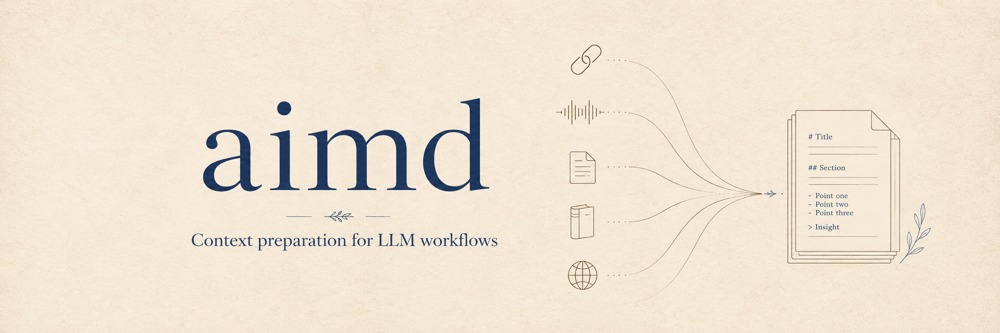

<div align="center">
  

  
  
  
  
</div>

# aimd

Prepare LLM-ready context from URLs, audio/video, and documents.

`aimd` gives you one command that auto-detects input type, extracts or transcribes the content, converts it to Markdown, and returns a chunked text context suitable for downstream AI workflows.

## Highlights

- **One input command** for URLs, audio/video files, ebooks, PDFs, Markdown, text, and other MarkItDown-supported documents.
- **Media extraction** with `aimd-media`: yt-dlp URLs such as podcasts, YouTube, Bilibili, and local audio/video files.
- **Subtitle-first fallback**: download subtitles when available; otherwise download audio and transcribe with `mlx-audio` or `qwen-asr`.
- **Document conversion** through MarkItDown, with dedicated ebook chapter/image extraction in the `aimd-book` plugin.
- **Three interfaces**: CLI (`aimd`), HTTP API (`aimd-api`), and MCP server (`aimd-mcp`).

> OCR for scanned PDFs and images is planned. The monorepo now includes an `aimd-ocr` package scaffold so OCR can land without growing the transcript or document conversion code paths.

## Install

CLI-only install after release:

```bash
uv tool install aimd
aimd --help
```

Install API/MCP packages when needed:

```bash
# HTTP API
pip install aimd-api

# MCP server
pip install aimd-mcp

# Both
pip install aimd-api aimd-mcp

# Everything published by the workspace
pip install "aimd[all]"
```

From a source checkout, use the workspace directly:

```bash
git clone https://github.com/shuuul/aimd.git
cd aimd
uv sync --dev
uv run aimd --help
```

Platform notes:

- macOS transcription is optimized for Apple Silicon through `mlx-audio`.
- Linux transcription uses `qwen-asr` and requires a CUDA-capable GPU.
- Local file conversion is powered by MarkItDown. Ebook conversion is handled by `aimd-book`; today it supports EPUB-compatible ZIP/spine books and still shells out to the Pandoc CLI for chapter HTML conversion.

## Quick start

```bash
# Auto-detect input type
aimd audio.mp3
aimd "https://youtube.com/watch?v=..."
aimd book.epub
aimd notes.txt

# Common options
aimd audio.mp3 --output transcript.md
aimd audio.wav --engine mlx --language zh
aimd "https://youtube.com/watch?v=..." --cookies-from-browser chrome
aimd "https://youtube.com/watch?v=..." --raw-transcript
```

## CLI usage

### Audio and video files

```bash
aimd interview.m4a
aimd lecture.mp3 --engine auto
aimd audio.wav --engine mlx
aimd audio.wav --engine qwen
aimd audio.wav --model mlx-community/Qwen3-ASR-1.7B-4bit
```

Engines:

| Engine | Platform | Notes |
|--------|----------|-------|
| `auto` | macOS/Linux | Selects the best available backend. |
| `mlx` | Apple Silicon | Uses `mlx-audio`; default local backend on macOS when available. |
| `qwen` | Linux/CUDA | Uses `qwen-asr`; default local backend on Linux when available. |

### URLs

```bash
aimd "https://www.youtube.com/watch?v=..."
aimd "https://www.bilibili.com/video/BV..."
aimd "https://www.xiaoyuzhoufm.com/episode/..."
```

Subtitles are simplified to plain text by default. Use `--raw-transcript` to preserve SRT/VTT formatting.

For authenticated or restricted content:

```bash
aimd "https://youtube.com/watch?v=..." --cookies cookies.txt
aimd "https://www.bilibili.com/video/BV..." --cookies-from-browser "chrome:default"
```

### Documents

```bash
aimd book.epub
aimd book.mobi
aimd book.azw3
aimd document.pdf
aimd notes.md
aimd document.epub --output output.md
```

Book files are expanded into a structured output directory:

```text
book_name/
├── book_name.md
├── chapters/
└── images/
```

The book pipeline preserves spine order, extracts images, converts chapters through Pandoc, and applies Markdown cleanup.

Current note: `aimd-book` owns the ebook converter and routes `.epub`, `.mobi`, and `.azw3` as book inputs. The implemented extraction pipeline is EPUB-compatible; non-EPUB ebook formats may still need a later format-specific conversion step before the same cleanup pipeline can succeed.

### MarkItDown plugins

`aimd` uses MarkItDown for local files with plugins enabled. The workspace packages `aimd-media` and `aimd-book` register standard `markitdown.plugin` entry points, so installing `aimd` also installs the ASR and ebook converters.

You can also use the plugins from MarkItDown directly:

```bash
markitdown --list-plugins
markitdown --use-plugins book.epub -o book.md
markitdown --use-plugins audio.mp3 -o transcript.md
```

## HTTP API

Run the API server:

```bash
aimd-api
```

Endpoints:

```bash
curl http://127.0.0.1:8000/healthz
curl http://127.0.0.1:8000/v1/engines

curl -X POST http://127.0.0.1:8000/v1/process \
  -H "Content-Type: application/json" \
  -d '{
    "input_source": "https://www.youtube.com/watch?v=...",
    "transcribe_engine": "auto",
    "language": "en"
  }'
```

OpenAPI docs are available at `/docs` and `/redoc`.

## MCP server

Run the stdio MCP server:

```bash
aimd-mcp
```

Tools:

- `healthz`
- `list_engines`
- `process_input`

`process_input` mirrors the CLI/API flow and accepts options such as `input_source`, `transcribe_engine`, `model`, `language`, `output_file`, `save_original`, `cookies`, `cookies_from_browser`, and `raw_transcript`. For MCP, temporary files are controlled by the `AIMD_TEMP_DIR` environment variable.

## Configuration

```bash
# Optional yt-dlp configuration
export YT_DLP_CONFIG_HOME="/path/to/config"
export YT_DLP_CACHE_DIR="/path/to/cache"

# Optional temporary directory for downloads, transcoding, and ebook extraction
export AIMD_TEMP_DIR="/path/to/writable/tmp"
```

You can also pass `--temp-dir` on the CLI.

## Development

```bash
uv sync --dev --upgrade
uv run prek --all-files
uv run pytest -q
```

Useful maintenance commands:

```bash
uv run prek autoupdate
uv build --all-packages
uv version --bump patch
```

Project layout:

```text
packages/
├── aimd/            # Core CLI, routing, MarkItDown runner
├── aimd-api/        # FastAPI service package
├── aimd-mcp/        # MCP stdio server package
├── aimd-media/      # yt-dlp URLs, subtitles, audio fallback, ASR plugin
├── aimd-book/       # MarkItDown plugin for ebook spine/image extraction and cleanup
├── aimd-ocr/        # OCR package scaffold for scanned PDFs/images
└── aimd-html/        # Defuddle CLI wrapper for readable HTML extraction
```

## Architecture

`aimd` is now a uv workspace. The main package uses MarkItDown as the local-file conversion contract and follows a ports/adapters layout:

- `application` owns orchestration and task routing.
- `process_input.py` acts as the facade/router; local file processors call `MarkItDown(enable_plugins=True)`.
- Feature packages register MarkItDown plugins: `aimd-media` for local audio/video ASR and `aimd-book` for ebooks. `aimd-book` is the package name for book-like formats even though the current extraction pipeline is EPUB-compatible. `aimd-ocr` is the next plugin scaffold, and `aimd-html` wraps Defuddle-backed HTML extraction.
- `aimd-media` owns URL media extraction: yt-dlp metadata, subtitle download, cookie handling, audio download fallback, and ASR.
- The main `aimd.infrastructure` wraps media/MarkItDown markdown results into `TextContext` chunks.
- CLI/API/MCP packages translate interface requests into application use-cases. Output file persistence is adapter-owned and shared through `aimd.application.services.output_writer`; it is not part of `ProcessInput`.

All processing returns a shared `TextContext` shape: title, chunks, and split metadata.

## License

MIT. See [LICENSE](LICENSE).
